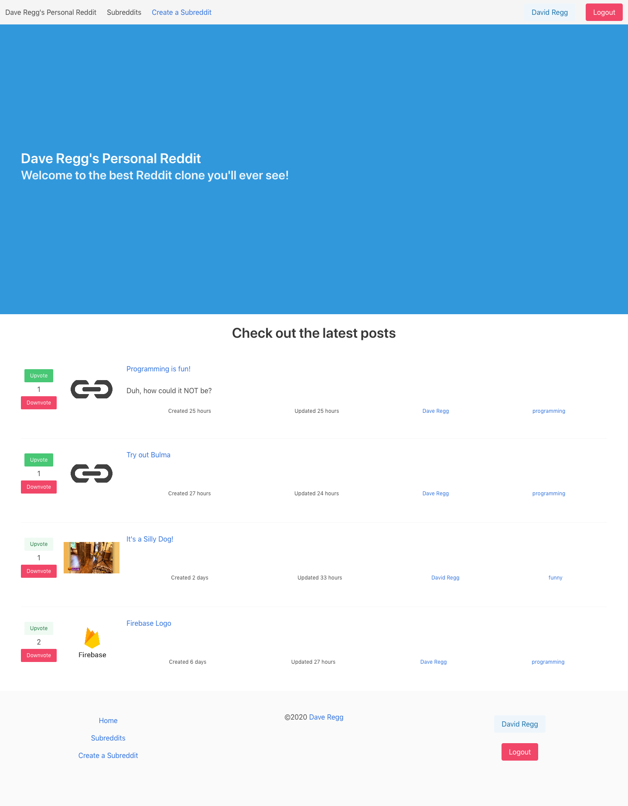

# Reddit-Clone-2
> Recreating a less polished version of Reddit using React and Redux as the client side and Firebase Firestore for the backend. Bulma is used to style the pages.

## Table of contents
* [General info](#general-info)
* [Screenshots](#screenshots)
* [Technologies](#technologies)
* [Setup](#setup)
* [Features](#features)
* [Resources](#resources)
* [Status](#status)
* [Inspiration](#inspiration)
* [License](#license)
* [Contact](#contact)

## General info
Inspired by [The Coding Garden](https://github.com/CodingGarden/vue-firestore-reddit-clone)'s [YouTube code along](https://www.youtube.com/watch?v=UjX5ZE359ck). However, the video used Vue/Vuex, while I was more inspired to create the clone with React/Redux. The application uses Firebase Firestore methods to interact with the backend. The client and store is created with my own [React/Redux Boilerplate](https://github.com/drregg6/cra-redux-boilerplate) with create-react-app as the base.

## Screenshots


## Technologies
* Node - version 12.3.1
* React - version 16.13.1
* Sass - version 1.26.5
* firebase - version 7.23.0
* date-fns - version 2.16.1
* bulma - version 0.9.1

## Setup
1. Clone the repo
```sh
git clone https://github.com/drregg6/reddit-clone-2.git
```
2. Install NPM packages
```sh
npm install
```
3. Set up a Firebase/Firestore

## Features
* [x] Generate Vue App
* [x] Create Firebase Project
* [x] Add Firebase Auth
  * https://firebase.google.com/docs/auth/web/google-signin
  * https://firebase.google.com/docs/auth/web/manage-users
* [x] Save user on login
  * [x] Update Rules
* [x] Add a few subreddits in Firestore
  * philadelphia
  * programming
  * pics
  * funny
* [x] Show Subreddits on Home Page
* [x] Show Single Subreddit
* [x] New Post Form
  * Update Rules
* [x] Display Posts on Subreddit Page
  * Types: Image/Text/Url


## Extra
* [x] Hide submit form if not logged in
* [x] Show Usernames
* [x] Show User Images
* [x] Format Dates
* [x] Fix card formatting
* [x] Search/Filter Posts
* [x] UpVote/DownVote Posts
  * Update Rules
  * [x] Order by total score
  * [x] Order by created
* [x] Add comment to Post
  * Update Rules
* [x] User Profile
  * [x] Show Submitted Posts
  * [x] Show Comments
  * [x] Edit User
* [x] Edit Post
* [x] Edit Comment
* [x] Reply to Comment
* [x] Display Error Image if bad link/error
* [ ] Cloud Function Score Aggregator (???)
  * https://firebase.google.com/docs/firestore/solutions/aggregation#solution_cloud_functions
* [x] Delete Post
  * [x] Cloud Function "Cascade Delete" comments
* [ ] Upload Images to Firebase storage

## Resources

* https://angularfirebase.com/tag/firestore/


## Status
Project is: _in progress_

## Inspiration
The project is a inspired by [The Coding Garden](https://github.com/CodingGarden/vue-firestore-reddit-clone)

## License
Distributed under the MIT License. See `LICENSE` for more information.

## Contact
Dave Regg - [@daveregg](https://www.twitter.com/daveregg) - dave.r.regg@gmail.com

Project Link: [Dave Regg's Personal Reddit](https://pure-stream-37591.herokuapp.com/)